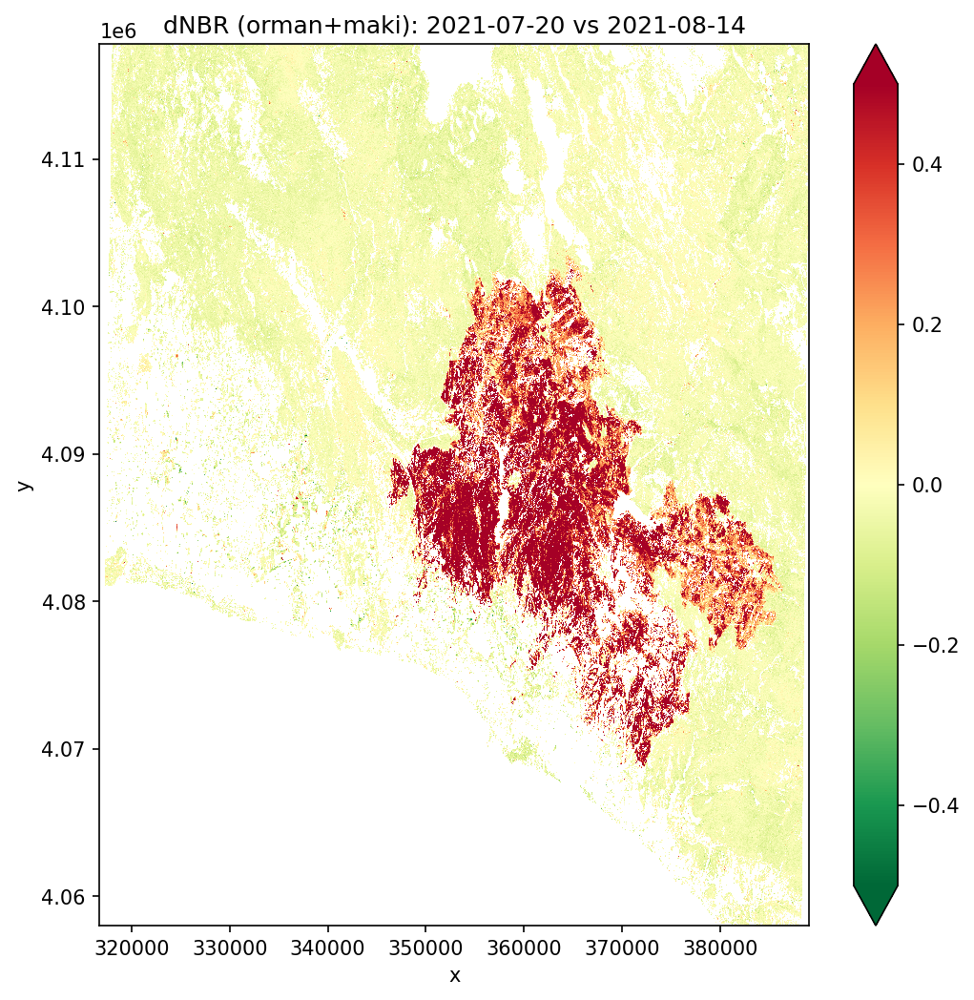
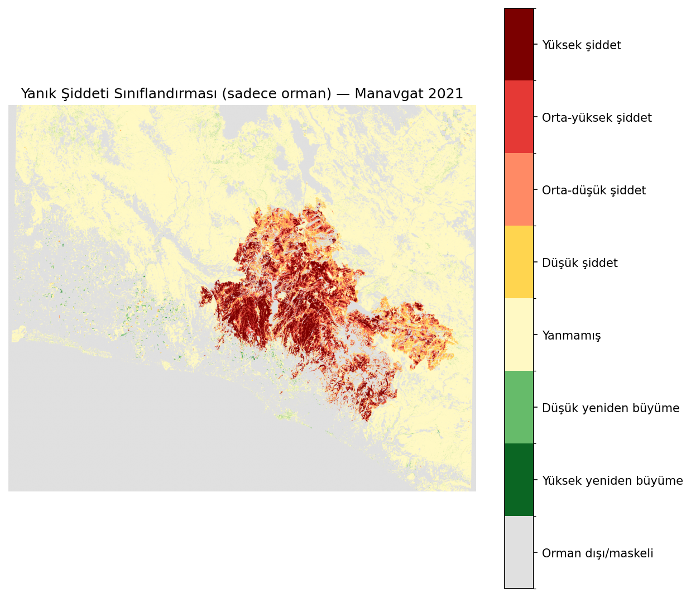
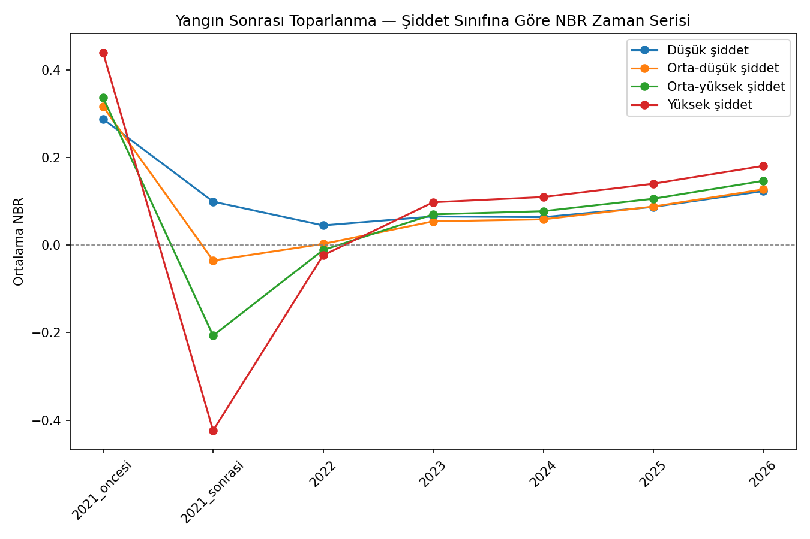
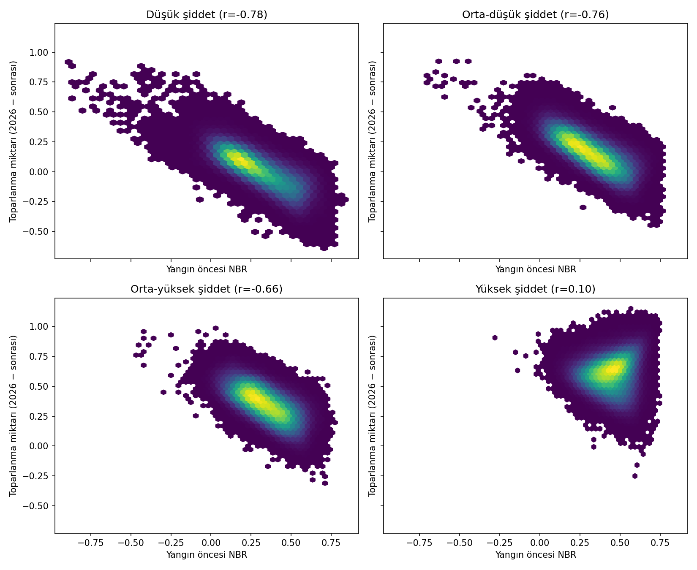

# 🔥🌲 Uydu Görüntüleriyle Orman Yangını Sonrası Toparlanma Takibi
# Satellite-Based Post-Wildfire Vegetation Recovery Tracking

---

## 🇹🇷 Amaç

Bu proje, uydu görüntüleri kullanılarak orman yangınlarının etkilediği alanların tespit edilmesini ve bu alanlardaki bitki örtüsünün zaman içinde nasıl (ve ne kadar) toparlandığının izlenmesini amaçlamaktadır. Temel motivasyon, büyük ölçekli doğal afetlerin etkisini elle/sahada değerlendirmenin pratik olmadığı durumlarda, uzaktan algılama verisiyle otomatik ve tekrarlanabilir bir analiz süreci kurmaktır.

## 🇬🇧 Purpose

This project detects wildfire-affected areas from satellite imagery and tracks how (and how much) vegetation in those areas recovers over time — building an automated, repeatable alternative to manual, on-the-ground damage assessment.

---

## Case Study

**2021 Manavgat / Gündoğmuş wildfires** (Antalya, Türkiye).

## Data Sources

| Source | Purpose | Access |
|---|---|---|
| [Sentinel-2 L2A](https://sentinel.esa.int/web/sentinel/missions/sentinel-2) | Multispectral satellite imagery | [Microsoft Planetary Computer](https://planetarycomputer.microsoft.com/) STAC API — free, no billing account required |
| [ESA WorldCover 10m](https://esa-worldcover.org/en) | Forest/shrubland masking | Planetary Computer STAC API |
| [Copernicus DEM GLO-30](https://planetarycomputer.microsoft.com/dataset/cop-dem-glo-30) | Elevation, slope, aspect | Planetary Computer STAC API |

## Method

1. **dNBR** (differenced Normalized Burn Ratio) — standard remote-sensing burn severity index.
2. **Cloud/water/land-cover masking** (Sentinel-2 SCL + ESA WorldCover) to keep only forest/shrubland pixels.
3. **USGS burn severity classification**, validated against officially reported burned-area statistics.
4. **Multi-year NBR time series** (2021–2026) to track vegetation recovery.
5. **Terrain-aware predictive model** (Linear Regression / Random Forest) estimating long-term recovery from pre-fire vegetation vigor, burn severity, and terrain (elevation, slope, aspect).

## Results

- Estimated burned forest area ≈ 40,656 ha — about **72%** of the officially reported figure (56,663 ha) for Manavgat.
- Long-term recovery is driven mainly by **pre-fire vegetation vigor** (site quality), largely independent of burn severity.
- Predictive model: Linear Regression R² = 0.33, Random Forest R² = 0.41.






## Setup

```bash
git clone <repo-url>
cd wildfire-recovery-cv
python3 -m venv venv
source venv/bin/activate
pip install -r requirements.txt
```

## Usage

```bash
python src/compute_dnbr.py
python src/classify_severity.py
python src/build_timeseries.py
python src/analyze_recovery_drivers.py
python src/model_recovery.py
```

## Status

Actively under development.

## Data Attribution

Contains modified Copernicus Sentinel data (via Microsoft Planetary Computer). ESA WorldCover © ESA WorldCover project ([CC BY 4.0](https://creativecommons.org/licenses/by/4.0/)). Copernicus DEM © DLR/Airbus.

## License

MIT