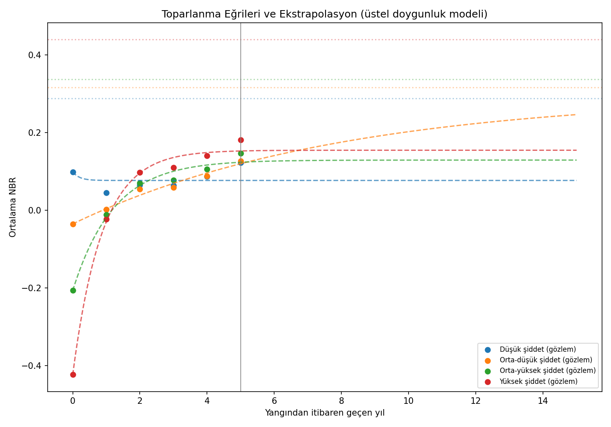

# 🔥🌲 Uydu Görüntüleriyle Orman Yangını Sonrası Toparlanma Takibi
# Satellite-Based Post-Wildfire Vegetation Recovery Tracking

---

## Amaç

Bu çalışma, uydu görüntüleri kullanılarak orman yangınlarının etkilediği alanların tespit edilmesini ve bu alanlardaki bitki örtüsünün zaman içinde ne ölçüde toparlandığının izlenmesini amaçlamaktadır. Çalışma kapsamında, 2021 yılında gerçekleşen Manavgat/Gündoğmuş orman yangını bir vaka çalışması olarak ele alınmış; yangının etkilediği alan, şiddet dağılımı ve 2021-2026 yılları arasındaki toparlanma süreci sayısal olarak modellenmiştir.

## Veri Kaynakları ve Yöntem Yaklaşımı

Çalışmada hazır/etiketlenmiş bir veri seti kullanılmamaktadır. Bunun yerine, Sentinel-2 uydusuna ait ham çok bantlı (multispectral) görüntüler, Microsoft Planetary Computer üzerinden STAC API aracılığıyla, belirlenen tarih ve koordinatlar için doğrudan çekilmektedir. Bulut/su maskeleme, arazi örtüsü sınıflandırması, mozaikleme ve indeks hesaplamaları çalışma kapsamında geliştirilen kodla yapılmaktadır.

| Kaynak | Kullanım Amacı | Erişim |
|---|---|---|
| Sentinel-2 L2A | Çok bantlı uydu görüntüsü | Microsoft Planetary Computer STAC API |
| ESA WorldCover (10m) | Orman/çalılık alan sınıflandırması | Planetary Computer STAC API |
| Copernicus DEM GLO-30 | Yükseklik, eğim, bakı | Planetary Computer STAC API |

*Veri erişimi için ilk aşamada Google Earth Engine değerlendirilmiş, ücretsiz kullanım için dahi ön ödeme talep edilmesi nedeniyle Microsoft Planetary Computer'a geçilmiştir.*

## Kullanılan Temel İndeks: NBR ve dNBR

**NBR (Normalized Burn Ratio)**, yakın kızılötesi (NIR) ve kısa dalga kızılötesi (SWIR) bantları kullanılarak hesaplanan bir bitki örtüsü/yanıklık indeksidir:

```
NBR = (NIR − SWIR) / (NIR + SWIR)
```

Sağlıklı bitki örtüsü NIR bandında yüksek, SWIR bandında düşük yansıma gösterirken; yanmış veya çıplak toprak bunun tersi bir davranış sergilemektedir. Bu nedenle NBR değeri, bir alandaki bitki örtüsünün yoğunluğu/sağlığı hakkında sayısal bir gösterge sunar.

**dNBR (differenced NBR)**, aynı alanın yangın öncesi ve sonrası NBR değerleri arasındaki farktır ve yanık şiddetinin belirlenmesinde kullanılır:

```
dNBR = NBR(yangın öncesi) − NBR(yangın sonrası)
```

Bu yöntem, USGS (ABD Jeoloji Kurumu) tarafından standartlaştırılmış ve uzaktan algılama literatüründe yaygın olarak kullanılan, doğrulanmış bir tekniktir (Key & Benson, 2006).

## Yöntem

1. Yangın öncesi ve sonrası görüntü çiftinden dNBR hesaplanması ve USGS eşiklerine göre şiddet sınıflandırması yapılması.
2. Bulut, su ve tarım arazisi gibi analiz dışı alanların maskelenmesi.
3. Sonuçların resmi kurum verileriyle (yanan alan istatistiği) karşılaştırılarak doğrulanması.
4. 2021-2026 yılları arasında çok yıllık NBR zaman serisi oluşturulması.
5. Toparlanma düzeyini etkileyen faktörlerin (yangın şiddeti, yangın öncesi bitki yoğunluğu, arazi özellikleri) istatistiksel olarak analiz edilmesi.
6. Yükseklik, eğim ve bakı gibi arazi özelliklerinin modele eklenmesi.
7. Regresyon tabanlı tahmin modelleri (Linear Regression, Random Forest) ile toparlanma düzeyinin modellenmesi; mekansal otokorelasyondan kaynaklanan değerlendirme sapmasının mekansal blok doğrulamasıyla giderilmesi.
8. Şiddet sınıfları bazında toparlanma süresinin eğri uydurma yöntemiyle tahmin edilmesi.

## Araştırma Soruları

- Yangının etkilediği alan ve şiddet dağılımı nedir, bu sonuç resmi verilerle ne ölçüde örtüşmektedir?
- Toparlanma düzeyini belirleyen temel faktör yangının şiddeti midir, yoksa arazinin kendi özellikleri midir?
- Etkilenen alanların yangın öncesi duruma dönmesi ne kadar sürmektedir?

## Bulgular

- Tahmini yanık orman alanı ≈ 40.656 ha olup, resmi olarak bildirilen rakamın (56.663 ha, Tarım ve Orman Bakanlığı) yaklaşık **%72**'sine karşılık gelmektedir.
- Toparlanma düzeyini belirleyen temel faktörün, yangının şiddetinden çok, **arazinin yangın öncesi bitki yoğunluğu** olduğu tespit edilmiştir. Yükseklik ve bakı (kuzeye bakan yamaçlarda daha yüksek toparlanma) ikincil düzeyde katkı sağlamaktadır.
- Tahmin modeli, mekansal otokorelasyon etkisi giderilerek değerlendirildiğinde Linear Regression için R²=0,28, Random Forest için R²=0,30 performans göstermektedir. Bu değer, modelin toparlanma düzeyindeki değişkenliğin yaklaşık üçte birini açıklayabildiğini, kalan kısmın ölçülmeyen faktörlere (müdahale süresi, mikro-iklim, toprak yapısı vb.) bağlı olduğunu göstermektedir.
- Orta-yüksek ve yüksek şiddetli alanlarda yaklaşık 1 yıl içinde bir platoya ulaşıldığı, ancak bu düzeyin yangın öncesi seviyenin altında kaldığı gözlemlenmiştir. Düşük ve orta-düşük şiddetli alanlarda ise mevcut veri, toparlanma süresinin istatistiksel olarak güvenilir biçimde kestirilmesine yetmemektedir.




## Yöntemsel Not

Çalışmanın ilk aşamasında, toparlanma örüntülerinin kümeleme (clustering) yöntemleriyle gruplandırılması planlanmıştır. Ancak veri analizi ilerledikçe daha belirgin bir araştırma sorusu ortaya çıkmıştır: toparlanmayı belirleyen temel faktörün yangın şiddeti mi, yoksa arazi özellikleri mi olduğu. Bu sorunun denetimli regresyon modelleriyle daha doğrudan test edilebilmesi nedeniyle yöntem bu yönde genişletilmiştir. Kümeleme tabanlı analiz, aşağıda belirtilen planlanan geliştirmeler kapsamında ileride değerlendirilecektir.

## Planlanan Geliştirmeler

- **Yoğun zaman serisi:** Yıllık tek görüntü yerine, her yaz döneminde erişilebilen tüm bulutsuz görüntülerin kullanılarak toparlanma süresi tahminlerindeki belirsizliğin azaltılması.
- **Genellenebilirlik testi:** Aynı yöntemin 2021 yılına ait diğer büyük yangın bölgelerine (Marmaris, Bodrum, Köyceğiz) uygulanarak bulguların tek bir olaya özgü olup olmadığının sınanması.
- **Kümeleme analizi:** Toparlanma hızına göre bölgelerin gruplandırılması.
- İnteraktif görselleştirme / gösterge paneli ve temel birim testlerinin eklenmesi.

## Proje Yapısı

```
wildfire-recovery-cv/
├── src/
│   ├── common.py                    # Ortak veri erişimi, maskeleme ve mozaikleme fonksiyonları
│   ├── compute_dnbr.py              # dNBR hesaplama
│   ├── classify_severity.py         # Şiddet sınıflandırması ve alan istatistiği
│   ├── build_timeseries.py          # Çok yıllık NBR zaman serisi
│   ├── analyze_recovery_drivers.py  # Toparlanma sürücüsü analizi ve arazi özellikleri
│   ├── model_recovery.py            # Tahmin modeli (mekansal doğrulamalı)
│   └── estimate_recovery_time.py    # Toparlanma süresi eğri uydurma
├── outputs/
├── requirements.txt
└── README.md
```

## Kurulum

```bash
git clone <repo-url>
cd wildfire-recovery-cv
python3 -m venv venv
source venv/bin/activate
pip install -r requirements.txt
```

## Kullanım

```bash
python src/compute_dnbr.py
python src/classify_severity.py
python src/build_timeseries.py
python src/analyze_recovery_drivers.py
python src/model_recovery.py
python src/estimate_recovery_time.py
```

## Durum

Aktif geliştirme aşamasındadır.

## Veri Atfı

Copernicus Sentinel verisi içerir (Microsoft Planetary Computer üzerinden işlenmiştir). ESA WorldCover © ESA WorldCover project ([CC BY 4.0](https://creativecommons.org/licenses/by/4.0/)). Copernicus DEM © DLR/Airbus.

## Lisans

MIT